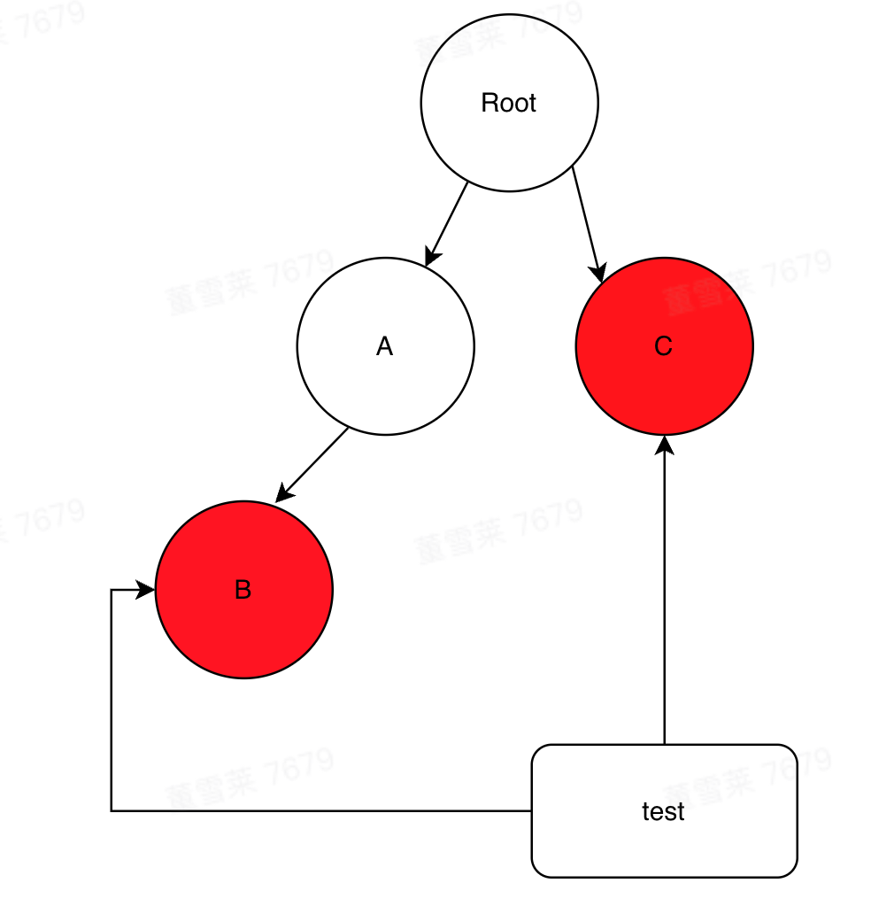

### 简介

- 不到 200 行源码，超短
- 精确的渲染组件，只渲染你想要渲染的组件
- 只能在 React 和 React-Native 环境中使用
- 最终目标是节约生命

### 使用场景

- 更新某个数据时通知依赖这个数据的所有组件渲染



例如你有一个数据**test**，红色的 b 组件和 c 组件都依赖这个数据更新，update-manager 可以帮助你自动通知 B 和 C 渲染而不影响 Root 和 A。

### 怎么用

- npm install —save @weishenmebunengyongzhongwen/update-manager
- 在根组件中引入

```jsx
import UpdateManager from "@weishenmebunengyongzhongwen/update-manager";
```

- 创建实例

```jsx
function Root() {
  const updateManager = new UpdateManager({
    /*可选的初始化数据 最好加上*/
    pathA: {
      pathB: {
        pathC: ["hello world"],
      },
    },
  });
}
```

注意：只能在函数组件中使用

- 将实例通过 props 或者 context 传入需要的组件并使用 useDeps 收集依赖

```jsx
function B ()
  const { variableName } = updateManager.useDeps({
  // 类似于vue的computed属性
    variableName(get){
      return get("pathA.pathB.pathC[0]");// 或者get(["pathA","pathB", "pathC",0])
    },
    }
  });
  return <div>{variableName}</div>
}

```

- 更新数据

```jsx
useEffect(() => {
  updateManager.setState({
    "pathA.pathB.pathC[0]": "I like Tom And Jerry",
  });
}, []);
```

完整代码：

```jsx
import UpdateManager from '@weishenmebunengyongzhongwen/update-manager';
function Root () {
 const updateManager = new UpdateManager({
/*可选的初始化数据 最好加上*/
   pathA: {
      pathB: {
        pathC: ["hello world"]
      }
    }
});
useEffect(() => {
  updateManager.setState({
   "pathA.pathB.pathC[0]": 'I like Tom And Jerry'
  });
},[])
return <div>
  <A updateManager={updateManager}/>
  <C updateManager={updateManager}/>
</div>
}
...
function B ({updateManager}) {
  //解构中的名字和useDeps参数中方法名必须一致，这里的方法名是variableName返回值中就会有个variableName
  const { variableName } = updateManager.useDeps({
    variableName(get){
      // get用法与lodash的get一致，可以是'A.B.C[1]'也可以是[A,B,C,1], 使用了get的数据才会被收集依赖
      return get("pathA.pathB.pathC[0]");// 或者get(["pathA","pathB", "pathC",0])
    },
  });
  return <div>{variableName}</div>
}
function A (props) {
  return <div><B {...props}/></div>
}
function C({updateManager}) {
   const { anyNameIsOk } = updateManager.useDeps({
    anyNameIsOk(get){
       return get("pathA.pathB.pathC[0]");// 或者get(["pathA","pathB", "pathC",0])
    },

  });
return <div>{anyNameIsOk}</div>
}
```

上面代码中第一次加载后组件 C 和 B 都会渲染

### updateManager.setState(params)

- 参数类型: {[path: string]: any}
- path 是数据在 updateManager 中的路径，所有数据都放在 updateManager.datas 中。
- 和 react 的 setState 不同，updateManager.setState 使用后会同步更新数据。

### updateManager.useDeps(params)

- 参数类型: { [functionName:string]: (get: (path: string | string[]) ⇒ any) ⇒ any }
- 返回值类型：{[functionName:string]: any}
- 返回值类型中的 key 名就是参数中的函数名，值是函数执行后的返回值。
- 参数中的函数会有一个 get 方法，get 的参数是一个 string 代表路径。
- get 方法的参数可以是 string 类型，如：”A.B.C[0]”，也可以是数组，如：[”A”, ”B”, ”C”, 0]
